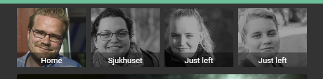

# picture-status-card
This card displays the status on a shadow area on the card. The picture-entity card does not support remove the name and display status centered.
## Screens 
Here I used 4 cards to show different pictures on different states.

<a href="docs/screen_1.png" target="_blank"></a>

## Usage
Download the files `picture-status-card.js` and the images in `img` forlders to your home assistant config. Add a module link to the `picture-status-card.js` file. The link needs to be the same as where you put it.
Example:
```yaml
resources:
  - url: /local/custom_cards/picture-status-card.js
    type: module
```
Configure the card properties.

### Example

**ui-lovelace.yaml:**

```yaml
...
  cards:
    - type: custom:picture-status-card
      entity: sensor.presence_tomas
      image: /local/img/presence/tomas_presence_away.jpg
      # font_size: 1em
      font_color: white
      card_height: 90px
      state_image:
        Home: /local/img/presence/tomas_presence.jpg
        Just arrived: /local/img/presence/local/tomas_presence.jpg
```


### Properties
Some of the properties that could be set. *italic* is not mandatory.

| Property |Description
|:---------|-----------
| entity | Your media-player
| image | Default image to display
| card_height| the height of the card
| state_image| A list of state and corresponding imagepath `[state]: [path to image]`, see example
|*font_color*| The color to use for text (css style)
|*font_size* | The size of the font (css style)

## Repos 
- [helto4real, Original cards](https://github.com/helto4real/lovelace-custom-cards)
- [helto4real, Tomas Hellströms, Hass config using the card](https://github.com/helto4real/hassio)
