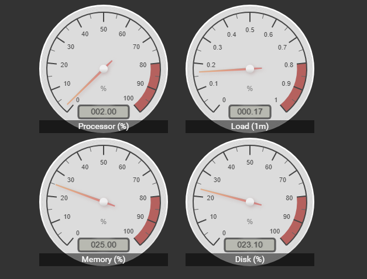

# canvas-gauge-card
This card allows you to use the awesome gauges at https://canvas-gauges.com/ in your lovelace GUI. This is still a very early and untested alpha version. Tested only on chrome and safari browsers. 

If you want to support the developer, please support the lib devs of the canvas-gauges.

## Screens 
Here is a some different screens from my own setup. But the possibilites to make your own look and feel are great.

<a href="docs/screen1.png" target="_blank"></a>
<a href="docs/screen2.png" target="_blank"></a>

## Usage
Download the files `canvas-gauge-card.js` and `gauge.min.js` to your home assistant config. Add a module link to the `canvas-gauge-card.js` file. The link needs to be the same as where you put it.
Example:
```yaml
resources:
  - url: /local/custom_cards/canvas-gauge-card.js
    type: module
```
Configure the card properties.

Skip `name`property if you dont want the name with the shadow area to show.

Use the javascript names of properties from the examples at https://canvas-gauges.com/documentation/examples/. Click on an example that you like, check the JS version and copy the properties to the lovelace yaml file. Just remove the ',' after copy from site. Here is an example from one of my config for better clarity.

```yaml
- type: custom:canvas-gauge-card
    entity: sensor.processor_use
    name: Processor (%)
    shadow_height: 10%
    font_size: 1em
    gauge:
        type: "radial-gauge"
        width: 220
        height: 220
        units: "%"
        minValue: 0
        maxValue: 100
        startAngle: 40
        ticksAngle: 280
        valueBox: true
        majorTicks: [
            "0",
            "10",
            "20",
            "30",
            "40",
            "50",
            "60",
            "70",
            "80",
            "90",
            "100",
        ]
        minorTicks: 2
        strokeTicks: true
        highlights: [
            {
                "from": 80,
                "to": 100,
                "color": "rgba(200, 50, 50, .75)"
            }
        ]
        colorPlate: "#ddd"
        borderShadowWidth: 0
        borders: false
        needleType: "arrow"
        needleWidth: 2
        needleCircleSize: 7
        needleCircleOuter: true
        needleCircleInner: false
        animationDuration: 1500
        animationRule: "linear"
        colorBorderOuter: "#fff"
        colorBorderOuterEnd: "#ddd"
        colorBorderMiddle: "#ddd"
        colorBorderMiddleEnd: "#ddd"
        colorBorderInner: "#ddd"
        colorBorderInnerEnd: "#ddd"     
```
Some of the properties that could be set. *italic* is not mandatory.

| Property |Description
|:---------|-----------
| entity | your sensor
| name | shows the name in shadow remove to hide it
| type | `"radial-gauge"` or `"linear-gauge"`
| width | width of the gauge
| height | height of the gauge
| *font_size* | size of name, leave out it will be dynamic
| *shadow_height* | xx% of total height is shadow height

For a complete documentation of available properties, please see https://canvas-gauges.com/documentation/user-guide/configuration

## Credits
- [Mikhus, canvas guages](https://github.com/Mikhus/canvas-gauges)