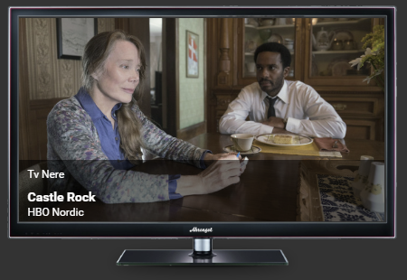
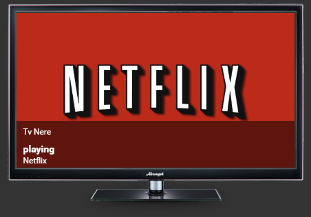

# media-player-card
This card is just a cooler way to show whats playing on your video media player, like the chromecast. You can still click it and control the media-player. Did not include controls cause I liked the look without it.
## Screens 

<a href="docs/screen_1.png" target="_blank"></a>
<a href="docs/screen_2.png" target="_blank"></a>

## Usage
Download the files `media-player-card.js` and the images in `img` forlders to your home assistant config. Add a module link to the `media-player-card.js` file. The link needs to be the same as where you put it.
Example:
```yaml
resources:
  - url: /local/custom_cards/media-player-card.js
    type: module
```
Configure the card properties.

### Example

**ui-lovelace.yaml:**

```yaml
...
  cards:
    - type: custom:media-player-card
      entity: media_player.my_chromecast
      image_folder: '/local/custom_cards/img'
```


### Properties
Some of the properties that could be set. *italic* is not mandatory.

| Property |Description
|:---------|-----------
| entity | Your media-player
| image_folder | The path to folder where you copied the images in ìmg` folder

## Repos 
- [helto4real, Original cards](https://github.com/helto4real/lovelace-custom-cards)
- [helto4real, Tomas Hellströms, Hass config using the card](https://github.com/helto4real/hassio)
